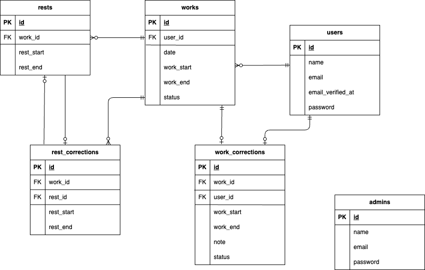

# attendance

## 環境構築

**Dockerビルド**</br>
1,git clone git@github.com:risa-prog/attendance.git<br/>
2,docker-compose up -d --build

**Laravel環境構築**</br>
1,docker-compose exec php bash<br/>
2,composer install<br/>
3,.env.exampleファイルから.envを作成し、環境変数を変更<br/>
4,php artisan key:generate<br/>
5,php artisan migrate<br/>
6,php artisan db:seed<br/>

## 使用技術(実行環境)

•PHP 7.4<br/>
•Laravel 8.83<br/>
•MySQL 8.0<br/>
.JavaScript</br>

## 開発環境

•home画面(ユーザー):http://localhost/attendance<br/>
•会員登録(ユーザー):http://localhost/register</br>
•home画面(管理者):http://localhost/admin/attendance/list<br/>
•phpMyAdmin:http://localhost:8080/<br/>
•MailHog:http://localhost:8025</br>

## メール認証

MailHogというツールを使用しています。
.envファイルのMAIL_FROM_ADDRESSは任意のメールアドレスを入力してください。　
会員登録後、登録したメールアドレス宛に送られてくるメールから認証を行ってください。</br>
MailHogにアクセスしたい時は、http://localhost:8025 に繋げてください。


## ER図



## PHPUnitを利用したテストに関して

1,テスト用の.envファイル作成</br>
cp .env .env.testing<br>
2,.env.testingファイルの文頭部分にあるAPP_ENVとAPP_KEYを編集</br>
APP_ENV=testing</br>
APP_KEY=</br>
3,.env.testingにあるデータベースの接続情報を以下のように書き換える</br>
(変更前)</br>
DB_CONNECTION=mysql</br>
DB_HOST=mysql</br>
DB_PORT=3306</br>
DB_DATABASE=laravel_db</br>
DB_USERNAME=laravel_user</br>
DB_PASSWORD=laravel_pass</br>
(変更後)</br>
DB_CONNECTION=sqlite</br>
  DB_DATABASE=:memory:</br>
4,以下のコマンドを実行する</br>
php artisan key:generate --env=testing</br>
php artisan config:clear</br>
php artisan migrate --env=testing

また、テスト実行時は `phpunit.xml` に以下の環境変数が設定されている必要があります

```xml
<env name="APP_ENV" value="testing"/>
<env name="DB_CONNECTION" value="sqlite"/>
<env name="DB_DATABASE" value=":memory:"/>
```

5,以下のコマンドでテストを実行する</br>
php artisan test   
